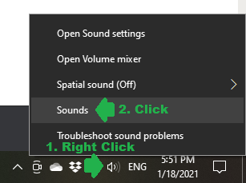
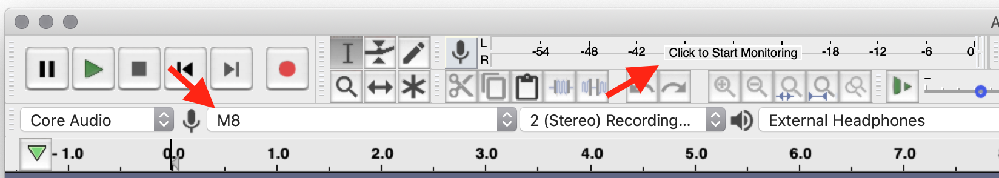
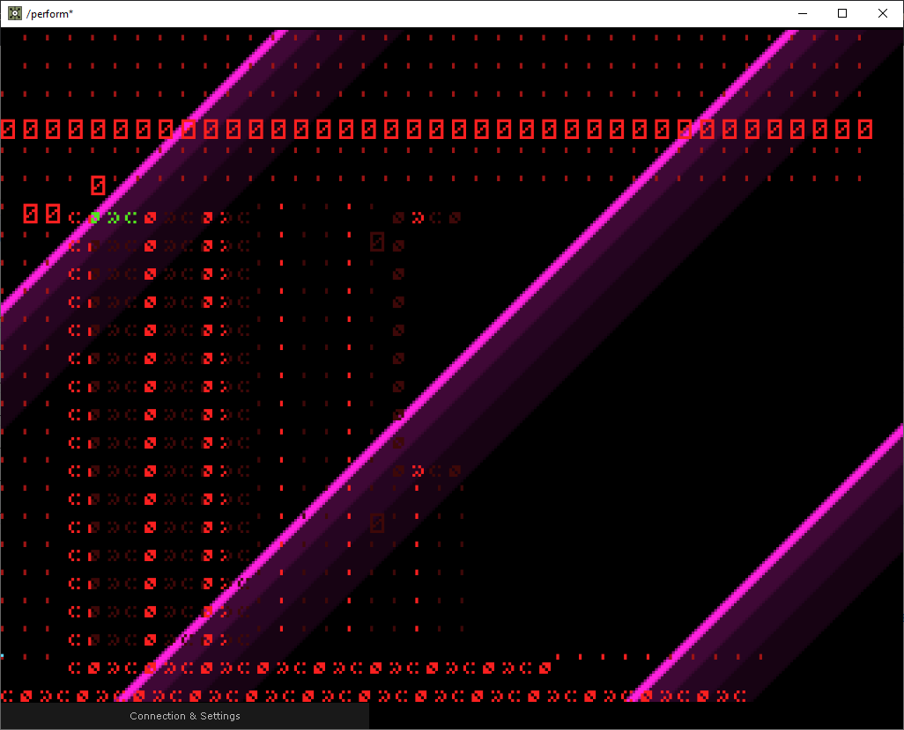

# M8 Headless Setup
## What is M8 Headless?
M8 Headless is a software package that allows you to run the M8 software on a Teensy device while using your computer's keyboard, monitor, and audio output. It is a low-cost alternative to purchasing an M8 handheld device.

# What You Need
## Hardware
To set up M8 Headless, you need to purchase a few things (total cost $35-100 USD):
1. **Teensy 4.1** ([Amazon](https://www.amazon.com/dp/B088D3FWR7/), $30 USD) ([PJRC](https://www.pjrc.com/store/teensy41.html), $27 USD): This is a microcontroller that the M8 software runs on; it's the M8's brain without the screen and keyboard. **Note:** You must have a **Teensy 4.1**; a 4.0 or earlier version will not work.
1. **microSD Card**: The microSD card is used to store your instruments, songs, samples, and more. Not all microSD cards work well on M8. You need one with good random read/write speeds. The following cards are known to work well:
   1. Lexar Professional 1800x 64GB (Expensive, but works well, [Amazon](https://www.amazon.com/dp/B07QM348D9/), $64 USD)
   1. Sandisk 32GB Ultra microSDHC (Cheaper, but reliable, [Amazon](https://www.amazon.com/dp/B00M55C0NS/), $8 USD)
1. **microUSB Cable**: You probably already have a million of these, but you'll need one for this!
1. **(Optional) microSD Card Reader**: If your computer does not have a built-in microSD card reader, you'll need to purchase one.
1. **(Optional) Numpad or Gamepad**: A small USB numpad keyboard or gamepad can be useful for simulating the keys on the M8 handheld. If you don't have one of these, you can still use your normal keyboard.

## Software
There's a few pieces of software you need to install to set up M8 Headless:
1. **TyTools:** This is used to install the M8 Headless firmware on your Teensy device. To install it:
   1. Visit https://github.com/Koromix/tytools/releases.
   1. Click on the link most recent version available for your operating system to download TyTools
      1. **For Mac OS:** Choose the most recent TyTools-x.x.x-osx.dmg file.
      1. **For Windows:** Choose the most recent TyTools-x.x.x-win64.msi file (or .zip, if you prefer).
   1. Install (or unzip) TyTools using the file you downloaded.
1. **TouchDesigner:** This is used to communicate with the Teensy device and display the M8 interface on your screen. To install it:
   1. Visit https://derivative.ca/download.
   1. Download TouchDesigner for your operating system (Mac OS or Windows).
   1. Install TouchDesigner using the file you downloaded.
1. **SD Card Formatter:** You only need this if you are using an old microSD card **and** your card is 32GB or smaller. This is used to format your microSD card in a way that allows the Teensy device to properly use it. To install it:
   1. Visit https://www.sdcard.org/downloads/formatter/.
   1. Download the tool for your operating system (Mac OS or Windows).
   1. Unzip the file you downloaded on your computer, and run the installer.
    
# Installation Steps
## Step 1: Format the microSD Card
ℹ **You only need to do this step if you are reusing an old microSD card. If this doesn't apply to you, skip to Step 2.**

⚠ **This step will delete everything on your microSD card. Backup any important data on it before proceeding.**

If you aren't using a brand new microSD card, it needs to be formatted correctly for it to be usable with M8 Headless.

### For microSD Cards 32GB or Less
1. Plug in your microSD card to your computer.
1. Open the SD Card Formatter tool you installed previously.

   ⚠ **Don't use the formatter tool built-in to Mac OS/Windows, or you may get unpredictable results.**
   1. In the **Select card** section, select your microSD card.
   1. In the **Formatting options** section, choose **Quick format**.
   1. Click **Format** and wait for the process to complete.
1. Unplug the microSD card from your computer.

### For microSD Cards Larger than 32GB
1. Plug in your microSD card to your computer.
1. Format the card:
   1. On **Windows:**
      1. Open **Explorer** and right-click on the microSD card. Select **Format...**
      1. Set the **File system** to **exFAT**.
      1. Check the **Quick Format** box.
      1. Click Start.
   1. On **Mac OS:**
      1. Open the **Disk Utility** app.
      1. Select your microSD card.
      1. Click the **Erase** button.
      1. Set the **Format** to **ExFAT**.
      1. Click **Erase**.
1. Unplug the microSD card from your computer.

## Step 2: Install M8 Headless Firmware
Next, you need to put the M8 firmware on your Teensy. To do this:
1. Download the latest M8 Headless firmware. To do this:
   1. Visit https://github.com/DirtyWave/M8HeadlessFirmware/tree/main/Releases.
   1. Click on the most recent **M8_Vx_x_x_HEADLESS.hex** file.
   1. **Right click** on the **View raw** link, and click **Save link as...** (or the similarly-named option in your browser). Save the .hex file on your computer.
   
      ⚠ **Make sure you are right clicking the "View raw" link and saving it instead of clicking the Download button. The Download button won't download the file correctly.**
      
      
1. If you own an M8 or other Teensy devices, unplug them from your computer.
1. Plug in your microUSB cable to your Teensy device, and plug the other end **directly** into your computer.

    ⚠ **Do not plug the USB cable into a USB hub, or you may run into problems!**
1. Open the TyUploader tool that was part of the TyTools installation you performed earlier. Another app called TyCommander was installed too, but that's not what you want.
1. You should see your Teensy device in the dropdown list. It may be named something like "HalfKay," "Teensyduino," or "M8" if there is existing M8 firmware on the device. Make sure your device is selected.
1. Click the Upload button.
1. Select the .hex file you downloaded earlier.
1. Wait for the process to complete. The device's name should change to **M8** in the dropdown.

## Step 3: Install M8 TouchDesigner and Run M8 Headless
Finally, we need to install the M8 TouchDesigner app that lets your computer communicate with the  M8 Teensy. To do this:
1. Download the latest M8 TouchDesigner app. To do this:
   1. Visit [https://github.com/DirtyWave/M8DisplayTouchdesigner](https://github.com/DirtyWave/M8DisplayTouchdesigner).
   1. Click the green **Code** button, then click **Download ZIP**.
   
      
   1. Unzip the file you downloaded on to your computer.
1. Plug in your microSD card into your Teensy device. The Teensy microSD card slot isn't spring-loaded, so make sure the card is inserted all the way.
1. Plug your Teensy **directly** into your computer using a microUSB cable. **Do not use a USB hub.**
1. (Optional) Plug in your numpad or gamepad, if you're using one. It's okay to plug it in to a USB hub.
1. Open the **M8DisplayTouchdesigner** folder from the ZIP you extracted earlier.
1. Open **M8DisplayTouchdesigner.toe**. TouchDesigner will load, and you should see a window with diagonal pink lines.

   
1. Click **Connection & Settings** at the bottom of the window.
1. Click the **Serial Port** dropdown.
   - **Windows:** You'll see 1 or more numbered COM ports. Select each one until the pink lines are replaced with the M8 screen.
   - **Mac OS:** Select the port named **usbmodem**. The pink lines should be replaced with the M8 screen.
   
   
1. (Optional) In the Connection & Settings screen, configure the keys used for the various M8 buttons to map them to keys on your keyboard or numpad. If you're using a gamepad, you'll need some way to map its buttons to keyboard keys.

## Step 4: Set Up M8 Input Audio Monitoring
In order to hear the audio from the M8 Teensy, you need to enable monitoring of the M8 Input device on your computer. You can do this with any software that supports this (like a Digital Audio Workstation (DAW) such as Ableton Live), but some simple recommendations follow.

### Windows
The simplest way to monitor the M8 Input device is to do the following:

1. Right click on the 🔊 sound icon in the system tray and click **Sounds**.

   
1. Switch to the Recording tab. Find the M8 device in the list, select it, and click Properties.

   
1. Switch to the Listen tab. Check the Listen to this device box. Click OK.

   
   
### Mac OS
There are multiple options for Mac OS:
1. **Use Quicktime Player** (free, but there may be audio lag):
   1. Open Quicktime Player.
   1. Select **File > New Audio Recording**
   1. Click the dropdown button next to the 🔴 record button, and select the M8 input.
   1. Adjust the volume slider to hear the M8 input. You don't need to click the record button.
1. **Use Audacity** (free):
   1. Download and install Audacity from [https://www.audacityteam.org/](https://www.audacityteam.org/)
   1. Open Audacity.
   1. Open Audacity's **Preferences** menu.
   1. Select the **Recording** section on the left. Check the **Software playthrough of input** box.
   
      
   1. Exit the Preferences menu.
   1. Select **M8** as your microphone input, then click on the text that says **Click to Start Monitoring**. You should now hear M8's input through your speakers.
   
      
1. **Use Audio Hijack** (works, but costs $59 USD):
   1. You can purchase Audio Hijack here: [https://rogueamoeba.com/audiohijack/](https://rogueamoeba.com/audiohijack/)
1. **Use OBS Studio** (free, but overkill):
   1. You can download OBS Studio here: [https://obsproject.com/](https://obsproject.com/)
   
## Step 5: Read the Manual
You're done setting up M8 Headless! Check out the community [M8 Manual](https://www.notion.so/M8-manual-6d153aac1bbc45209fcaf51cfa53157e) to learn how to use it. You can also take a look at the additional [M8 Documentation](https://www.notion.so/dc3fe39bbc464879ac984f0a69cc61bf?v=fd554243d3fa43558901cf96984120b9) which includes tips & tricks, information on themes, instrument and song file formats.

# Updating Content on microSD Card
To add or remove files from the microSD card, do the following:
1. Close the M8 TouchDesigner app.
1. Unplug the Teensy device from your computer.
1. Remove the microSD card.
1. If you want to modify the files on the microSD card, plug it in to your computer, and update your files.
1. Reinsert the microSD card into the Teensy device. The microSD card slot is not spring-loaded, so make sure it's inserted **all the way**.
1. Reconnect the Teensy device to your computer.
1. Reopen the M8 TouchDesigner app.
1. Select the appropriate Serial Port in the M8 TouchDesigner app, if necessary.

# Troubleshooting
## Problem: TyUpdater says "IHEX parse error" when trying to install the M8 Firmware

This happens when the M8 Firmware was downloaded incorrectly. To solve this, carefully repeat **Step 2 (Install M8 Headless Firmware)** in the Installation Steps.

## Problem: None of the Serial Port options in TouchDesigner work
### I still only see the screen with pink diagonal lines
This happens when TouchDesigner can't see your Teensy device, if the firmware was not correctly installed, or if the microSD card is not detected. To solve this:
1. Make sure your Teensy is plugged in **directly** to your computer and not with a USB hub.
1. Make sure the microSD card is properly inserted:
   1. Close the M8 TouchDesigner app, and disconnect the USB cable from the Teensy device.
   1. Make sure the microSD card is inserted **all the way**.
   1. Reconnect the Teensy device, and reopen the M8 TouchDesigner app.
   1. Try the Serial Port options again.
1. Make sure your Teensy shows up as **M8** in the TyUpdater app. If it doesn't, try flashing the firmware again by following **Step 2 (Install M8 Headless Firmware)** in the Installation Steps.

### I see a completely black screen
This happens when incompatible firmware is used with the M8 TouchDesigner app. To solve this, carefully repeat **Step 2 (Install M8 Headless Firmware)** in the Installation Steps, ensuring that you are using the most recent version of the firmware.

## Problem: I can see the M8 screen in TouchDesigner, but it's extremely slow.
This happens when the M8 Teensy can't see your microSD card. To solve this, follow the steps in the **Updating Content on microSD Card** section.

## Problem: I can't see any of the content on my microSD card, or all of the directories are empty.
This happens when the M8 Teensy can't see your microSD card. To solve this, follow the steps in the **Updating Content on microSD Card** section.

## Problem: I updated the M8 firmware, and now the TouchDesigner app looks like this:

This happens when the M8 TouchDesigner app is out-of-date. To solve this, you need to update the M8 TouchDesigner app. Repeat **Step 3 (Install M8 TouchDesigner and Run M8 Headless)** in the Installation Steps.

## Problem: I pressed Escape and I'm stuck on a strange screen:

To solve this, press F1 to return to the M8 screen.

## Problem: I hit the white button on the Teensy and now the TocuhDesigner app is frozen
Pressing the white button on the Teensy resets the device. To solve this:
1. Unplug the USB cable from the Teensy, then plug it back in.
1. Close the M8 TouchDesigner app, then reopen it.

# Still Need Help?
Join us on Discord! https://discord.gg/7SVuZe9
